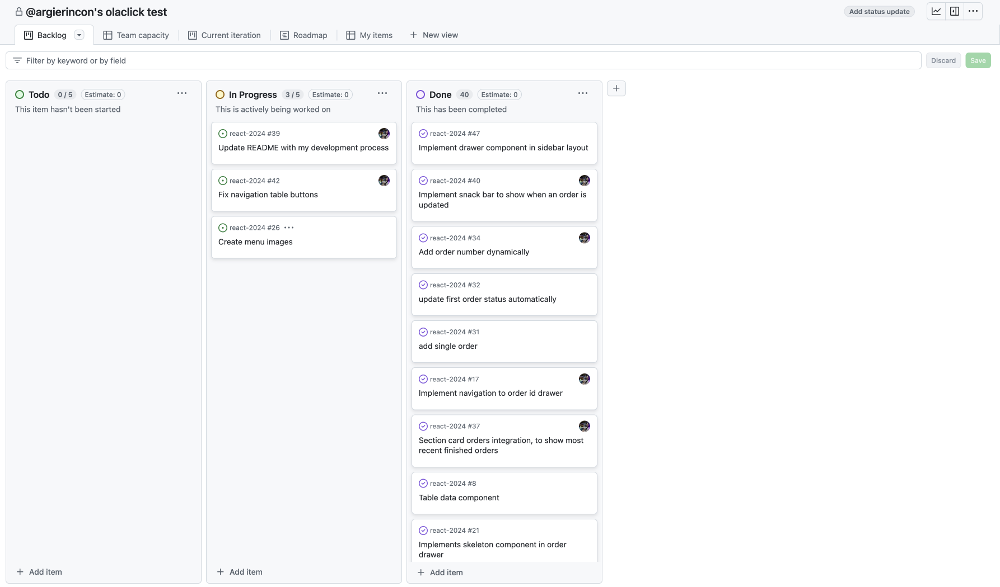
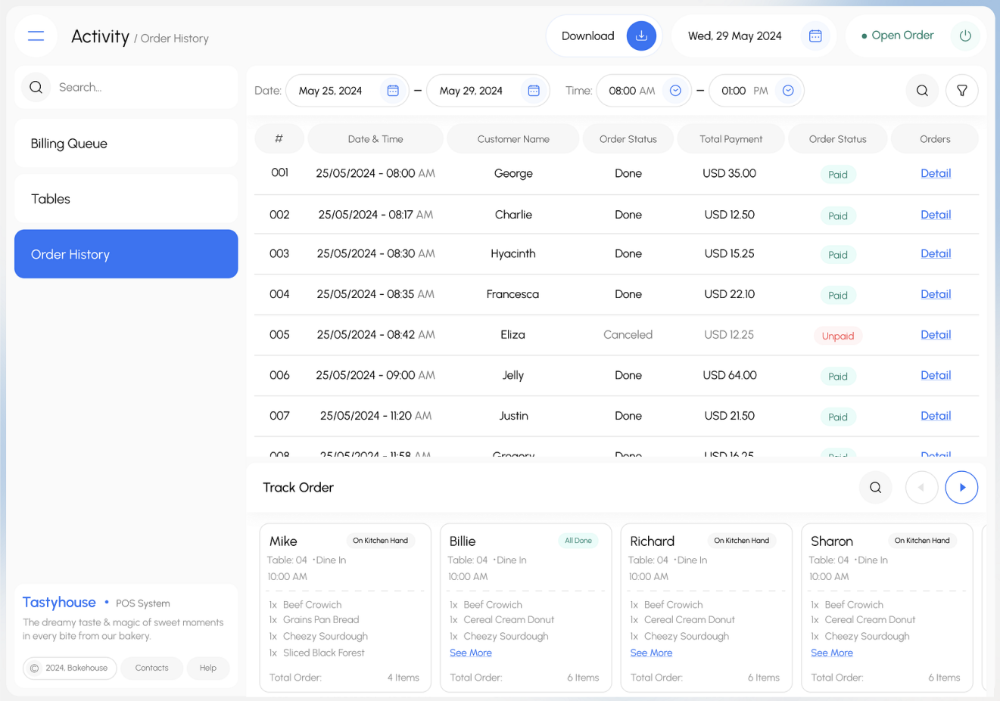
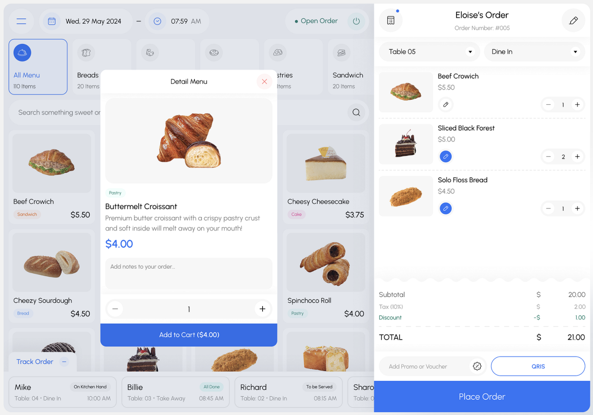

# Olaclick Challenge - Orders Manager :rocket:

Orders Manager es una solución para administrar las órdenes de un restaurante, permite cambiar el estado de las mismas y visualizar los detalles al seleccionar un elemento de la lista.

[Visita el proyecto desplegado aquí](https://orders-manager-e23b3.web.app/orders)

## Problema

El administrador de restaurante tiene una lista de órdenes que cada cierto tiempo cambian de estado.

Por ahora tenemos solo 3 estados de la orden:

- iniciado
- enviado
- entregado

**Requisitos:**

- Cambio de estado dinámico: Las órdenes cambian de estado periódicamente.
- Gestión automática: Si el estado de una orden es "Entregado", debe eliminarse automáticamente de la lista.
- Detalles de la orden: Al seleccionar una orden en la lista, se debe mostrar una página detallada con información del cliente, ítems y costos (ruta: /:ordenId).

## Proceso de Desarrollo

1. **Análisis del Problema:**  
   Lo primero fue analizar el problema e identificar los requisitos principales.

2. **Investigación y Selección de Prototipo:**  
   El siguiente paso fue buscar prototipos de plataformas para restaurantes que se ajustaran a mi vision para la presentación de los datos.

3. **Preparación del Entorno de Desarrollo:**

   - Una vez seleccionado el prototipo, hice el **fork del proyecto** en GitHub y lo instalé en mi equipo.
   - Configuré el entorno de desarrollo utilizando **Vue 3**, **TypeScript** y **Vite**.
   - Instalé **Tailwind CSS** para agilizar la creación de estilos y garantizar un diseño responsivo.

4. **Gestión de Versiones 📌**

   - Para manejar de manera organizada los cambios en el repositorio creé la rama `dev` para trabajar todos los cambios allí.
   - Y una vez al tener la solución funcional del proyecto realizar un pull request a la rama `main`.

5. **Configuración Inicial:**

   - Instalé y configuré **Vue Router** para gestionar la navegación de las rutas del proyecto, asegurando que la vista de detalles de las órdenes estuviera correctamente enlazada.
   - Busqué las fuentes utilizadas en el prototipo seleccionado, las descargué, las integré en el proyecto y configuré **Tailwind** para reconocer las variantes personalizadas de las fuentes.

   - Además, configuré un componente dinámico llamado `Icon` para manejar íconos personalizados.

6. **Gestión del estado global:**

   - Instalé y configuré **Pinia** como el sistema de gestión de estado global. Utilicé Pinia para almacenar los objetos obtenidos de las APIs en estados globales, facilitando la interacción entre los componentes y manteniendo un flujo de datos centralizado.

7. **Organización y Priorización de Ideas:**  
    Durante el desarrollo, pensé en muchas ideas que podía implementar en el proyecto.

   Pero para poder administrar mejor los esfuerzos y el tiempo decidí crear un **proyecto en GitHub Projects** para gestionar las ideas y los problemas que debía resolver.

   Creé tickets para registrar cada pensamiento que tenía o issues que debía resolver para así poder priorizar las tareas más importantes. Trabajar con listas de tareas o herramientas de planificación siempre me ayudan a mantener un flujo de trabajo claro y enfocado.

## Razonamiento detrás de la solución

Para comenzar a resolver los puntos principales del reto, decidí reutilizar un **componente Tabla responsive** que había adaptado previamente para otro proyecto personal.

Inicialmente, utilicé **objetos JSON estáticos** con la estructura de datos indicada en el enunciado del reto. Esto me permitió adaptar la tabla y verificar su funcionalidad. Una vez maquetada la tabla con los datos de prueba, desarrollé un **componente dinámico** para mostrar el detalle de una orden seleccionada desde la tabla.

Después de finalizar los componentes principales, me enfoqué en cómo abordar la problemática de manejar un **gran volumen de datos**, con múltiples escrituras y lecturas simultáneas.

### Exploración de Soluciones

1. **API REST con JSON Server:**

   - **Ventaja:** Rápida configuración para simular un backend básico.
   - **Desventaja:** La conexión no sería en tiempo real, lo que implicaría recargar la vista para visualizar los cambios.

2. **Implementación de Sockets o una Simulación de Sockets:**

   - **Ventaja:** Permitiría reflejar los cambios en tiempo real sin recargar la página.
   - **Desventaja:** No tendría persistencia de datos, algo necesario para manejar la actualización de los estados de las órdenes.

### Solución Final: Firebase

Finalmente, decidí utilizar **Firebase** ya que ofrece las herramientas que necesitaba, la **Persistencia de datos:** para poder mantener los estados actualizados de las ordenes,**Actualización en tiempo real:** para poder remover de la lista aquellas ordenes que fueron entregadas y por la capacidad de manejar un alto volumen de operaciones de escritura y lectura de manera eficiente.

#### Simulación de Creación de Órdenes

Para simular la creación de órdenes dinámicas y variadas, implementé un conjunto de **objetos estáticos** que contienen los datos base:

- **Clientes:** Una lista de nombres.
- **Bebidas, Platos de Fondo y Postres:** Tres objetos separados con elementos que representan los ítems del menú.

Con estos datos base, diseñé **funciones dinámicas** que generan órdenes aleatorias:

1. **Función de creación de una orden:**

   - Selecciona un nombre al azar de la lista de clientes.
   - Toma hasta dos elementos aleatorios de cada categoría de ítems (bebidas, platos de fondo y postres).

2. **Función de creación masiva de órdenes:**
   - Genera entre 1 y 20 órdenes aleatorias en una sola ejecución.

#### Manejo de Estados de las Órdenes

En el **store**, desarrollé las siguientes acciones:

1. **Actualización de estados:**

   - Consulta la colección de órdenes en Firebase y selecciona la orden más antigua.
   - Cambia su estado de **iniciada** a **enviada**, y luego de **enviada** a **entregada** cada 3 segundos aproximadamente.

2. **Creación automática de órdenes:**
   - Llama a la función que genera entre 1 y 20 órdenes nuevas.
   - Inserta estas órdenes en la base de datos en intervalos aleatorios de entre 30 y 60 segundos.

Estas acciones permiten simular un flujo de trabajo con una gran cantidad de escrituras y lecturas en la base de datos.

## GitHub Projects



## Prototipo base

**Vista de órdenes**


**Vista de detalle de la orden**


# Entorno de desarrollo 🔧

**Paso 1**
Para instalar las dependencias ejecuta el siguiente comando:

```bash
npm install
```

**Paso 2**
implementar credenciales de firebase

```env
VITE_API_KEY=tu-api-key
VITE_AUTH_DOMAIN=tu-auth-domain
VITE_PROJECT_ID=tu-project-id
VITE_STORAGE_BUCKET=tu-storage-bucket
VITE_MESSAGING_SENDER_ID=tu-sender-id
VITE_APP_ID=tu-app-id
```

**Paso 3**
Para iniciar el servidor de desarrollo, ejecuta el siguiente comando en la terminal:

```bash
npm run dev
```

# Desarrollado con 🛠️

- **Vue 3**
- **TypeScript**
- **Vite**
- **Tailwind CSS**
- **Pinia**
- **Vue Router**
- **Firebase**
